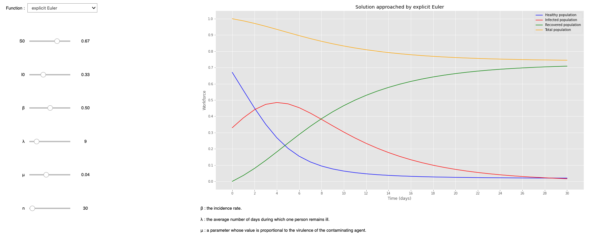

# COVID-19 SIR

A simulation of COVID-19 spread 
Methods implemented for the differential system (SIR model) :

* Explicit Euler
* Implicit Euler
* Runge Kutta 2 (Heun)
* Runge Kutta 4
  

> Details about the SIR can be founf on the  [notebook](SIR_notebook.ipynb)

### Authors
Salah Eddine LABIAD ([@s0v1x](https://github.com/s0v1x))
Mouad Aterhi ([@AterhiM](https://github.com/AterhiM))